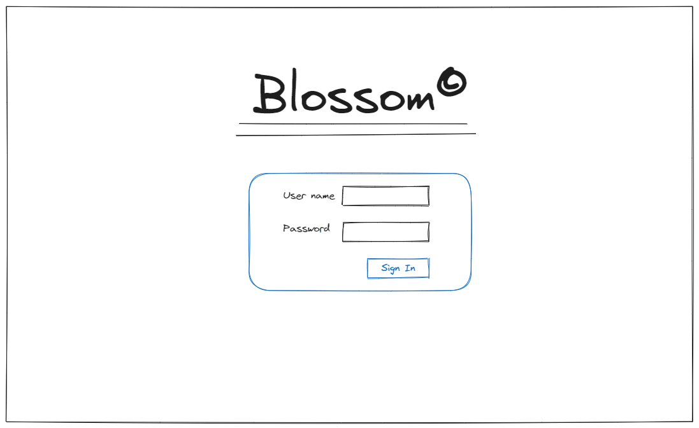
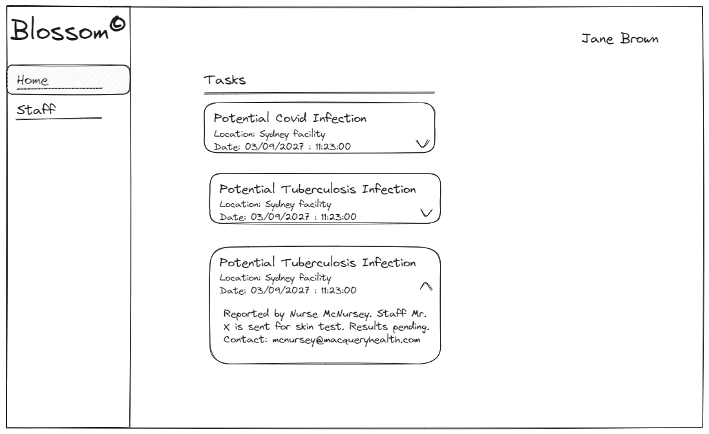
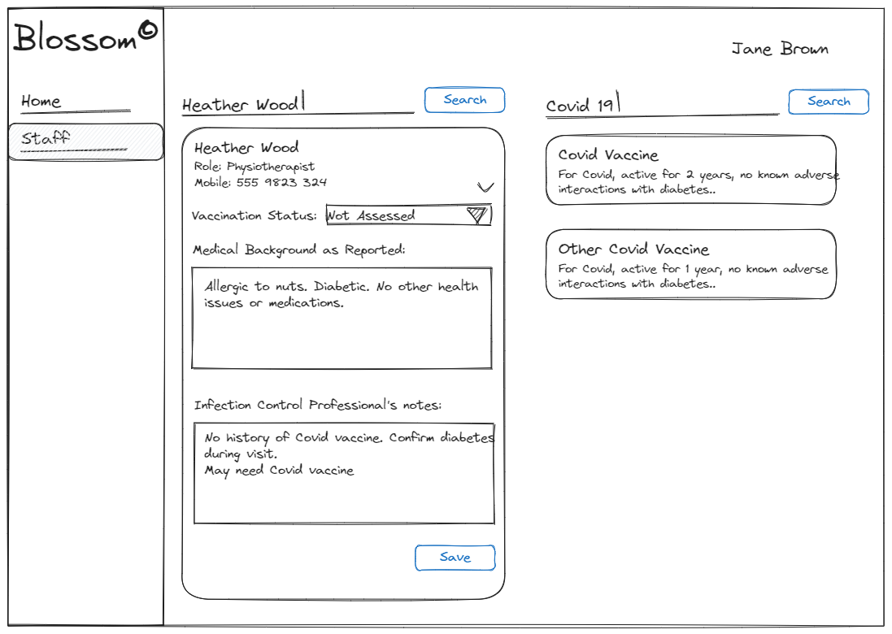

**Introduction**

This repository is created for you to implement your take home exercise. All your work should be included in this repository in the form of commits.

For your take home exercise, please consider the following hypothetical scenario and build a solution based on the details provided below. It may look like there is a lot to do, but that is not the case. Most of what’s given below are details to help you understand the requirements.

**Introducing Blossom**

Blossom is a greenfield project that is just starting in Ocean. It is a web based, single page application (SPA) aimed at infection control professionals, and its vision is to allow them to deal with many infection control related processes. 

One of these processes is assessing the vaccination status of new staff in a healthcare organisation where Blossom is used. Both the infection control professional, and the staff they are in charge of protecting against infections are employees of this organisation, which can be for example a private hospital. The process (when overly simplified for this exercise) expressed as a user scenario is as follows:

**User Scenario:**

Jane, a capable infection control professional, receives an email from the HR department notifying her that a new physiotherapist, Heather Wood, is starting work next week and fundamental information about her is already available as a staff member in the HR system. 

Blossom is integrated into the HR system used at MacQuery health, so some of that information is already available from Blossom. Specifically, Heather's mobile no and her email, her role in the organisation (clinician), her initial declaration in the form of free text, providing information about allergies she has (nut) and medications she is on (insulin) and her vaccination status against some infections (not vaccinated for Covid). 

Jane needs to get in touch with Heather, schedule a visit to have a face to face session to get more information about her medical history and any current vaccinations she may already have. Before the visit, Jane should take a look at available data for Heather and identify some vaccinations as candidates. Once the visit takes place, based on the information she gathered from Heather during the visit, Jane would decide which vaccines she should schedule for Heather to get before she can start work. Once Jane records one or more vaccines (or none, based on her findings) as a prerequisite for Heather to start work, Blossom will send emails to both Heather and the HR department, notifying both that the assessment is complete.

**Scenario Steps:**

- Jane checks her email (not in exercise scope)

- Jane logs into Blossom

- Jane sees a navigation drawer on the left hand side of the Page and Blossom displays a "Tasks" dashboard which contains a list of infection control related tasks. The list consists of items with a heading and some details only. The heading is a helpful text such as "suspected covid case", "suspected tuberculosis case" and the details are only the date and location, which may be "Syndey facility". The dashboard does not have anything else. These tasks are created automatically by Blossom in response to various medical information arriving from other systems. The tasks are clickable. Jane does not take any action in the dashboard page.

- Jane selects the staff section from the navigation drawer, and Blossom displays a staff section with a prominent search bar. Jane types in Heather's name in the search bar and Blossom displays Heather's name as a search result.

- Jane clicks on the search result and Blossom displays Heather's information from the HR system on the same page. Heather's vaccination status is displayed as "Not assessed."

- Jane reads Heather's initial medical history as reported by Heather.

- Jane adds some notes about Heather on the same page, as she reads her history. The system does not allow notes to be longer than a thousand characters.

- Jane uses a vaccine search bar on the same page to search for vaccines using the disease name, such as "covid", "tuberculosis", "polio".

- Jane clicks on search results, which displays brief information about the vaccine, such as the name of the disease it is meant to protect against, for how long the vaccine is effective (N years), and if it is known to cause any allergic reactions (can cause rash, can cause shortness of breath, no known adverse reactions etc)

- Jane calls Heather on her mobile and arranges a visit for her to visit Jane (not in exercise scope)

- Jane sets Heather's vaccination status to "Scheduled for assessment", then saves her changes via the save button.

**The Exercise**
The scenario steps provided above do not cover the whole scenario; Heather's visit is excluded to keep the exercise scope small, and we would normally break this scenario to User Stories with associated Jira card, which we do not do here: for this exercise, we would like you to keep things very simple. Assume that you just had a conversation with the domain expert in Ocean and wrote down the above scenario as a first draft. 

We would like you to implement the subset of Blossom that is described in the above scenario steps (**not the whole scenario, since the steps are a subset of it**). We deliberately did not go into too much detail about the UI layout, given this would not be fit to do in a user scenario in the first place, and we wanted to leave you some room to approach this as a design exercise in addition to implementation exercise. (there are some optional hints below though). Also, if you find some gaps in the descriptions, it is OK to interpret them in the way you see fit. Just make sure that you don’t do some large extra work: minimum is enough!

We would like to re-emphasise: we do not want you to spend days on this exercise! You can keep the visual polish to an absolute minimum, or use any Angular UI library that would provide nice looking components, so that you can focus on building the functionality. 

Please assume that at this point, there is no backend/API available; you're the only one who talked to the domain expert, and they want to see something working in their browser, that allows some interaction, something that's beyond wireframes or mockups of UI layout. This means some of the actual values such as "Not assessed", "Sydney facility" etc should be used in your implementation but with no backend endpoints to call to get them. This includes data displayed in response to search etc. How you approach this challenge is up to you, you can be as pragmatic as you want to be. However, you may want to consider how easy it would be to integrate your work to the backend APIs when they become available.

If you have solutions to not having the backend API ready that would take too much time to put in place for this exercise, feel free to follow a more basic approach but mention the solution you would prefer in your comments or anywhere else you see appropriate. You can use data that does not make any sense when you need to, i.e. Lorem ipsum instead of Googling medical information!

We would like you to use the latest version of Angular with strict Typescript configuration. As you develop your solution, please use small and frequent commits. This way, we can see how you work and how you break down an implementation task. We like helpful commit notes!. 

You are building an SPA mainly for desktop browsers, but it would not be too surprising if users would expect to use this SPA from their mobile devices, at least at a minimum level.

We would also like you to use Angular’s built in support for testing. Using whatever features Angular offers for testing, try to write a test for the functionality that allows Jane to view Heather’s information and perform various tasks as described in the scenario steps. To clarify, you don’t need to include vaccine search in your test scope. Testing can be a rabbit hole: there are many ways to test code. We do not want you to spend time writing extensive tests or trying to cover every angle. Keep your test scope to a minimum, a single test would be enough.

Other things you may want to consider are how to help your colleagues continue your work from where you left off. How would you make sure that someone can clone this repository and continue Blossom's UI development without you helping them in person?

We appreciate you'll have limited time you can allocate to this exercise, so please consider which aspects of developing a solution matters to you most and try to include those at a minimal level. We would like to learn what you consider to be important when developing software.

When you’re implementation is complete, please send us an email with the final commit hash included. We'll be looking forward to hearing from you.

**Please note that it is absolutely OK to get in touch with us and ask questions related to this exercise. We don’t see questions as failings at Ocean, we consider them as strength!**

## Hints
Here are some mockups drawn by an Ocean employee with no design skills at all. You may consider these to have been provided by the domain expert. You do not have to follow them, or if it helps, you can use them for your implementation, it is completely up to you.

