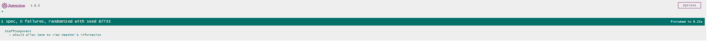
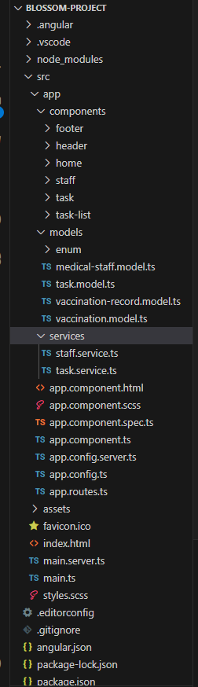
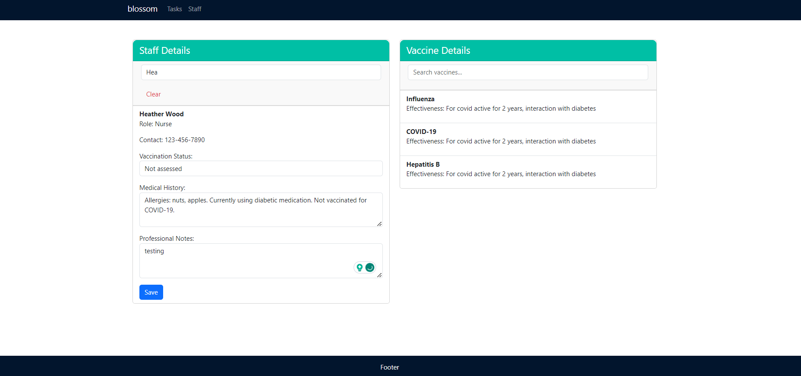
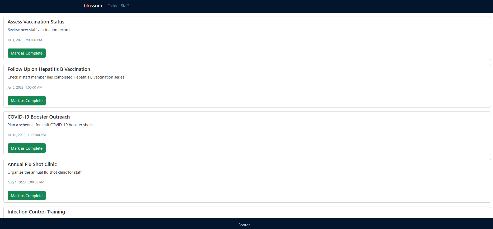
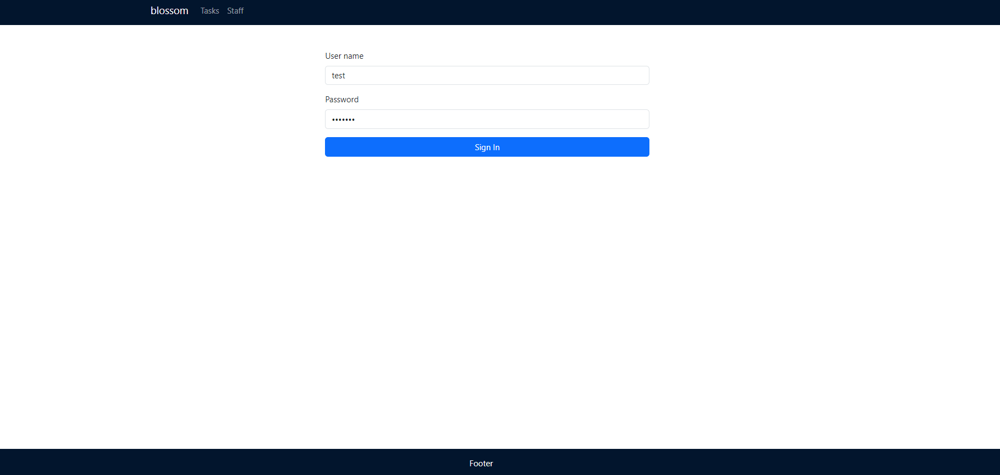

# BlossomProject

This project was generated with [Angular CLI](https://github.com/angular/angular-cli) version 17.0.3.

## Introduction

Blossom is an innovative web-based, single-page application (SPA) designed to streamline infection control processes within healthcare organizations. This greenfield project, emerging in the Ocean healthcare environment, is specifically tailored for infection control professionals. Its primary goal is to facilitate the management of vaccination statuses and medical histories of healthcare staff, thereby enhancing the efficiency and effectiveness of infection control measures.

## Setting Up the Development Environment

1. Clone the Repository
   - Clone the project using `git clone https://github.com/OceanHealthSystems/frontend-angular-takehome-ryan.git`
2. Install Dependencies
   - Navigate to the project directory (`cd BlossomProject`).
   - Run npm install to install all necessary dependencies.
3. Add Ng-Bootstrap
   - Run ng add `@ng-bootstrap/ng-bootstrap` to add Bootstrap to the project.

## Development server

Run `ng serve` for a dev server. Navigate to `http://localhost:4200/`. The application will automatically reload if you change any of the source files.

## Testing Credentials

For testing purposes, use the following credentials to access the application:

- Username: `test`
- Password: `test`

## Code scaffolding

Run `ng generate component component-name` to generate a new component. You can also use `ng generate directive|pipe|service|class|guard|interface|enum|module`.

## Build

Run `ng build` to build the project. The build artifacts will be stored in the `dist/` directory.

## Running unit tests

Run `ng test` to execute the unit tests via [Karma](https://karma-runner.github.io).

## Key Features

- User Authentication: Secure login system for accessing the application.
- Navigation Drawer: Intuitive navigation interface to access various sections like the Tasks dashboard and Staff section.
- Responsive Design: A user-friendly interface that adapts to both desktop and mobile devices.
- Staff Information Management: A dedicated section with search functionality to view and manage staff health data.
- Responsive Design: A user-friendly interface that adapts to both desktop and mobile devices.
- Vaccine Search and Information: An integrated system to search for vaccines and view essential details about them.

## Project Structure

## Coding Guidelines

`https://angular.io/guide/styleguide`

## Coding Guidelines

To get more help on the Angular CLI use `ng help` or go check out the [Angular CLI Overview and Command Reference](https://angular.io/cli) page.

## Few Interfaces

## Future Implementations

- State Management Integration
  - Integrate a state management library like NgRx to handle application state more efficiently.
- Development of a Login Page
  - Create a secure and user-friendly login page for authentication.
